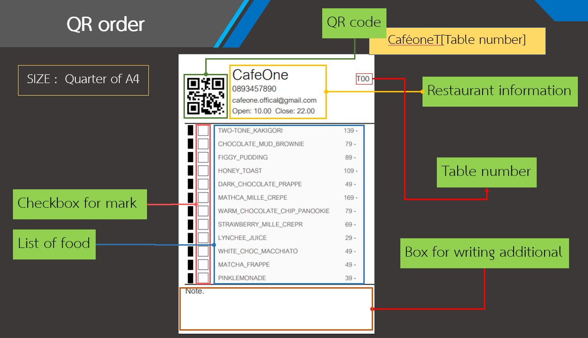
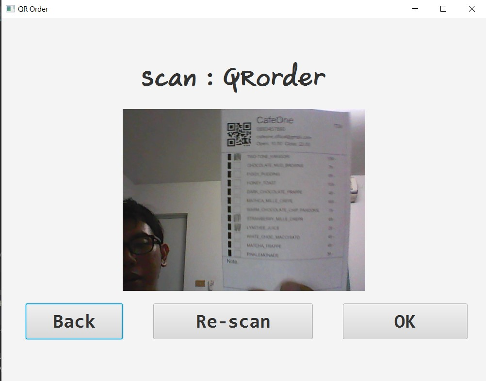
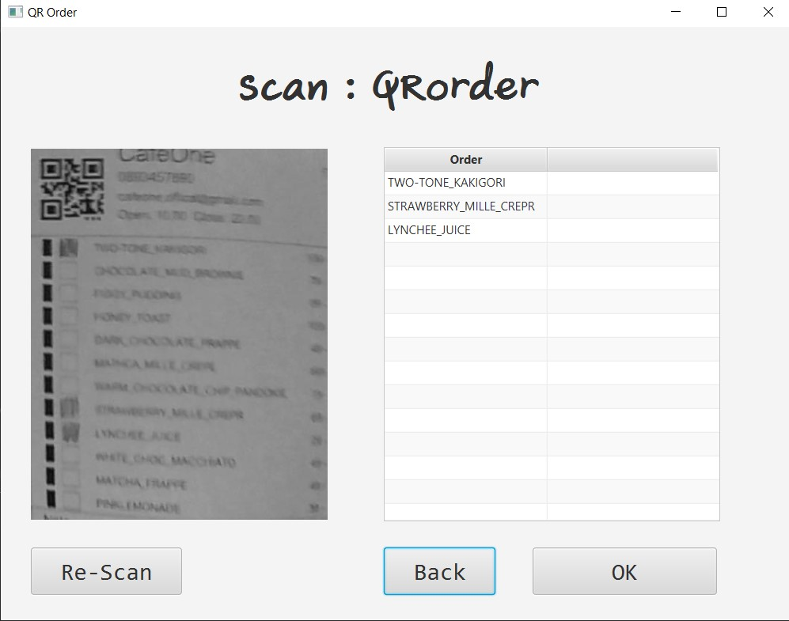

# QR order - Scan food orders with QR code
> This is a Java Desktop Application that helps to convert QR order (list of food with QR code) into RDF format (Turtle) and send to another computer via Gmail and summary of the list of food that ordered each day. This application uses QR code and PDF Library to create QR order, use a webcam to scan QR order and use OpenCV to convert QR order to Turtle.

## QR order (list of food with QR code)

## Scan QR order via webcam

## Result from scanning


## Table of contents
* [Technologies](#technologies)
* [Setup](#setup)
* [Features](#features)
* [Status](#status)

## Features
* Create QR order
* Scan Qr order by webcam
* Save list of food in RDF format(Turtle)
* Send list of food to another computer via Gmail
* Summary of the list of food that ordered each day

## Technologies
* Java/JavaFX - version 12
* Maven - version 3.6.1
* OpenCV - version 3.4.5
* Apache jena - version 3.10.0
* Turtle (RDF)
* Gmail
* QR code
* Webcam

## Setup
### Setup local environement
  1. Install JDK 12.0
  2. Install OpenCV 3.4.5
  3. Install Maven 3.6.1
  4. Install Apache jena 3.10.0
  5. Connect webcam to Computer cashier

### Setup parameter
  1. Open HelloFX.java with text editor
  2. Fill email cashier, password cashier, email kitchen, password kitchen
  3. Choses mode that this computer want to use between Cashier = main.fxml and Kitchen = kitchen.fxml
## Usage
> command line
```
mvn javafx:compile
mvn javafx:run
```

## Status
Project is: _finished_

