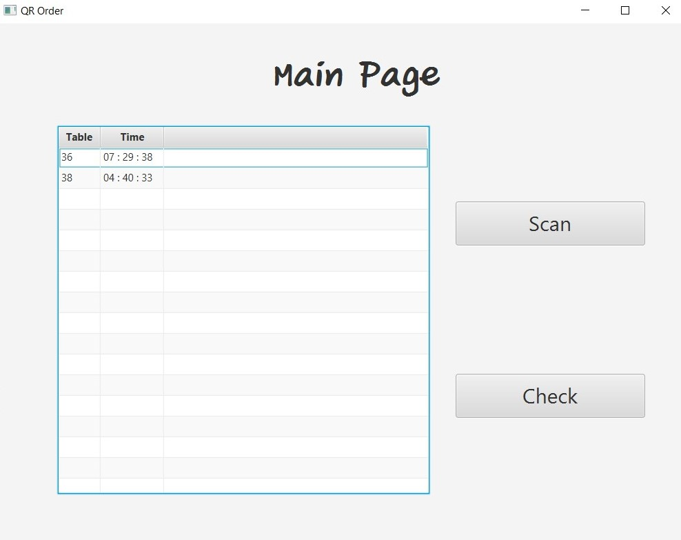

# QR order - Scan food orders with QR code
> This is a Java Desktop Application that helps to convert QR order (list of food with QR code) into RDF format (Turtle) and send to another computer via Gmail and summary of the list of food that ordered each day. This application uses QR code and PDF Library to create QR order, use a webcam to scan QR order and use OpenCV to convert QR order to Turtle.

## Main menu on computer kitchen

## Table of contents
* [Technologies](#technologies)
* [Setup](#setup)
* [Features](#features)
* [Status](#status)

## Features
* Create QR order
* Scan Qr order by webcam
* Save list of food in RDF format(Turtle)
* Send list of food to another computer via Gmail
* Summary of the list of food that ordered each day

## Technologies
* Java/JavaFX - version 12
* Maven - version 3.6.1
* OpenCV - version 3.4.5
* Turtle (RDF)
* Gmail
* QR code
* Webcam

## Setup
Describe how to install / setup your local environement / add link to demo version.

## Usage
Show examples of usage:
`put-your-code-here`

## Status
Project is: _finished_

